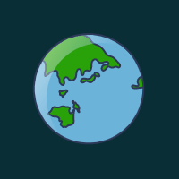

<h2 align="center"> 
  
  Olá, eu sou o Marcos Maciel!
  
</h2>

  <em>Front-End Developer | UI/UX Product Designer</em>

---

### 🚀 Um Pouco Sobre Mim

- 💼 Sempre buscando minha melhor versão!
- 💻 Apaixonado por desenvolvimento Front-End e criação de protótipos.
- 🎧 Amante de música.
- 🎮 Gosto de jogar videogame.

---

### 🛠️ Tecnologias e Ferramentas

  
  
  
  
  <!-- Continue com os outros ícones -->

---

### 📬 Entre em Contato

  
  

---

### 📊 Stats and Languages

  
  

---

### 🕵️‍♂️ Visitantes

  

---

<h3 align="center">👋 Obrigado pela visita!</h3>
