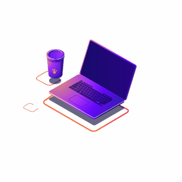

<h2 align="center"> :earth_americas: Hello World, sou o Marcos Maciel! :earth_americas:</h2>

<h3> :fallen_leaf: Um pouco sobre mim: </h3>

<ul>
<li> 🚀 Estou sempre em busca da minha melhor versão;</li>
<li> 💻 Apaixona por desenvolvimento Front end e criação protótipos</li>
<li> 🎧 Amo escutar <strong>música</strong</li> <li> 🎮 Gosto de jogar <strong>videogame</strong></li>
</ul>

 
<h3 align="center"> :heavy_check_mark: Tecnologias e Ferramentas: </h3>

 

<h3 align="center"> :pushpin: Entre em contato: </h3>

<h1 align="center">Stats and Languages:</h1>

## Visitors:

 

 
<h3 align="center"> Obrigado pela sua visita! :wave: </h3>

