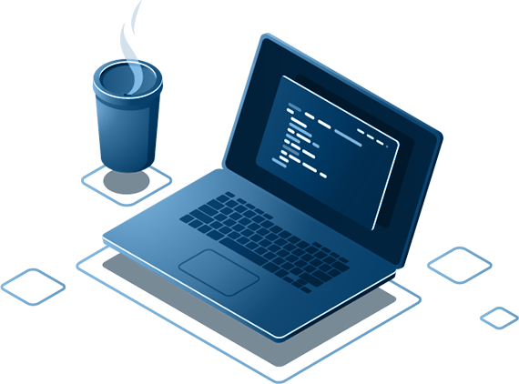

### Hey! Welcome to my profile! How is it going? 

- 🚀 I am currently studying Systems Development Analysis at [FIAP](https://www.fiap.com.br/)
- 💻  Future Developer Full Stack
- 📍 From PR living in São Paulo
- ✨ Learning is continuous and there will always be new challenges to be overcome.

### 💻 Where to find me
  

### I'm learning:

  
  
  
  
  
  

  

### Stats and Languages:
 
