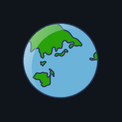

<h2 align="center">
  
  Olá, eu sou o Marcos Maciel!
  
</h2>

  <em>Front-End Developer | UI/UX Product Designer</em>

---

### 👨‍💻 Sobre Mim

- 💼 Desenvolvedor Front-End com foco em interfaces modernas e funcionais.
- 🎨 Apaixonado por UI/UX, criando experiências centradas no usuário.
- 🌎 Atualmente vivendo no México e fluente em espanhol, o que facilita a comunicação com clientes internacionais.
- 🚀 Sempre em busca da minha melhor versão, estudando e aplicando as melhores práticas no desenvolvimento web.

---

### 🛠️ Habilidades e Tecnologias

  
  
  
  
  
  

> ### Ferramentas que domino:
> - **Front-End**: React, Vue.js, JavaScript, HTML5, CSS3
> - **Design de Interfaces**: Figma, Adobe XD
> - **Outras Ferramentas**: Git, APIs RESTful, desenvolvimento responsivo

---

### 📈 Stats e Atividades Recentes

  
  
  
  

---

### 📫 Entre em Contato

  
  

---

### 🌐 Visitantes

  

---

<h3 align="center">👋 Obrigado pela visita!</h3>
